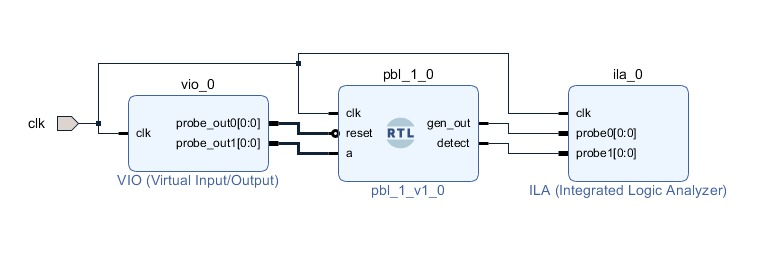
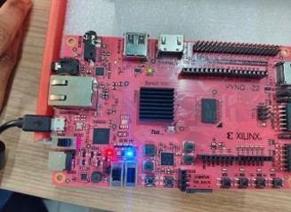
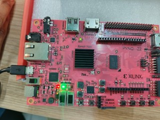
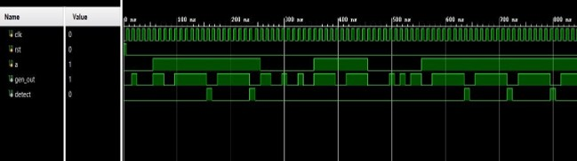

# FSM-Based-Sequence-Detector-and-Sequence-Generator-Combination-Circuit
FSM-based sequence detector and generator implemented in Verilog on FPGA, enabling real-time binary pattern detection with optimized state transitions and reliable hardware performance.

# Overview
This project implements a **Finite State Machine (FSM)-based Sequence Generator and Sequence Detector** integrated into a single digital system. Designed using **Verilog HDL** and deployed on a **PYNQ-Z2 FPGA**, the system can generate binary sequences and detect a predefined pattern (**01111110**) in real time with high accuracy and optimized hardware utilization.

# Tools and Techniques
-Hardware: PYNQ-Z2 FPGA (Zynq-7000)

-Software: Xilinx Vivado (Simulation, Synthesis, Implementation)

-Simulation & Debugging: Vivado Simulator, Integrated Logic Analyzer (ILA)

-Design Approach:

  -FSM Design (Mealy/Moore)
  
  -State Transition Optimization
  
  -RTL Design and Verification

# Working
The system operates as a **multi-stage FSM-driven pipeline**, combining sequence generation, controlled pattern insertion, and real-time detection.

**1.Initial Sequence Generation (8-bit Level)**
-The process begins with an FSM-based generator that produces an **8-bit random sequence**. This stage acts as the base data source for the entire system.

**2.Extended Sequence Formation (64-bit Level)**
-The generated 8-bit sequence is then fed into a second FSM module, which expands it into a **64-bit serial data stream**. This stage simulates a continuous data transmission environment where patterns may occur randomly.

**3.Controlled Pattern Injection**
-Between the second generator and the detector, a control signal (a) plays a crucial role:
  When **a = 0**: The system allows **pure random sequence flow**, meaning no guaranteed occurrence of the target pattern.
  When **a = 1**: The system intelligently **injects the predefined sequence (01111110)** into the data stream, ensuring that the detector receives the exact pattern.

**4.Real-Time Sequence Detection**
-The 64-bit stream is continuously monitored by the **FSM-based sequence detector**, which checks for the target pattern **bit-by-bit** using state transitions.
-The FSM progresses through states corresponding to each bit of the sequence.
-Only when the entire sequence is matched correctly, the detector asserts the output.

**5.Output Indication**
-Upon **successful detection**, the **output signal goes HIGH for one clock cycle**, turning ON an LED on the FPGA board.
-If the **sequence is not detected** or is partially matched, the **output remains LOW**, keeping the LED OFF.

### 🧩 System Block Diagram

### ⚙️ Hardware Implementation

# Result 
-Successful generation of **binary sequences** on FPGA.

-Accurate detection of sequence **01111110**.

-**Detection signal** asserted only on complete match.

-**No false detection** for partial sequences.

-Verified using **simulation waveforms** and **ILA outputs**.

-Hardware implementation confirmed via LED outputs on **PYNQ-Z2**.

# Future Scope
-Extend design for **multiple sequence detection**.

-Implement **higher-length and complex patterns**.

-Optimize FSM using **state minimization techniques**-Explore **low-power and high-speed FPGA optimizations**.

-Implement **Bit Stuffing** to handle repetitive patterns and improving detection robustness.

-**Display detected sequences** bit-by-bit using **FPGA board LEDs** for direct, real-time hardware-level identification.
